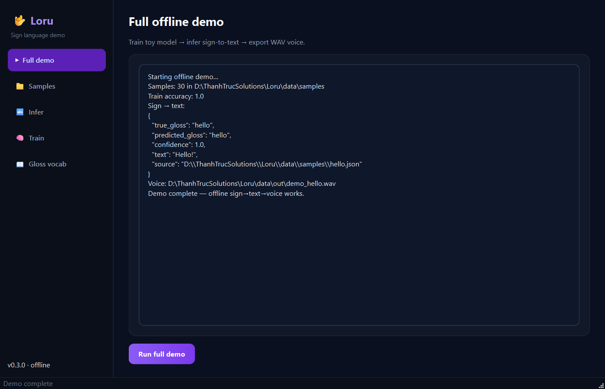
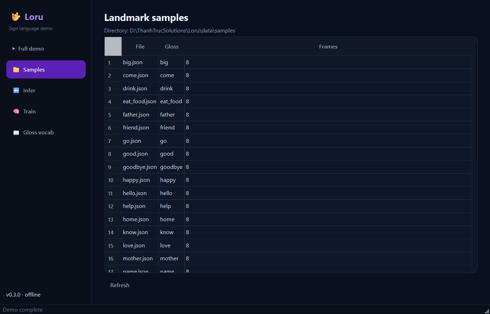
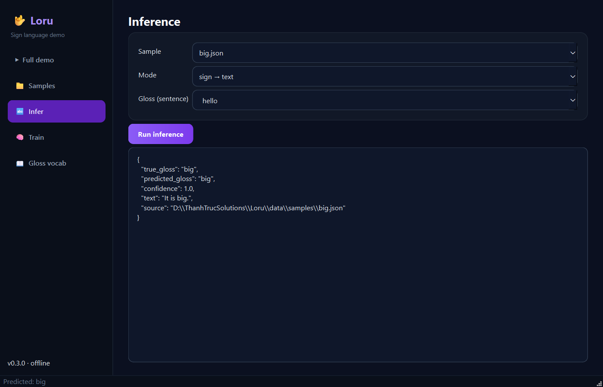
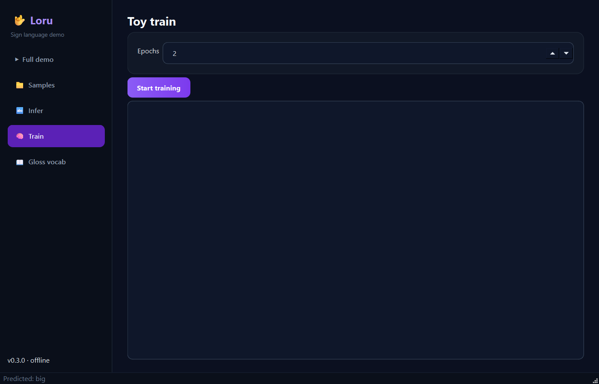
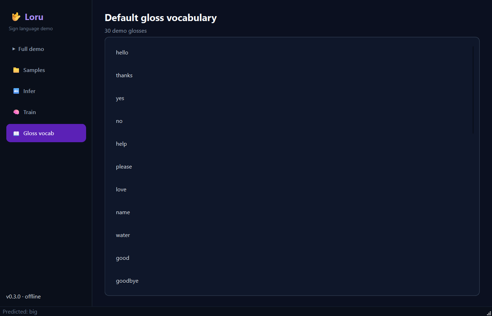

# Loru

[](https://www.python.org/downloads/)
[](pyproject.toml)
[](src/loru/gui/)
[](LICENSE)
[](https://github.com/mergeos-bounties)

**Loru** is an offline **sign language** toolkit: landmark sequences → gloss/text, and sign → **voice (WAV)** — demos and train loops without a GPU for the smoke path.

**Product:** [mergeos-bounties/Loru](https://github.com/mergeos-bounties/Loru)

---

## Table of contents

- [Highlights](#highlights)
- [Desktop GUI (Qt)](#desktop-gui-qt)
- [Screenshots](#screenshots)
- [Quick start](#quick-start)
- [CLI reference](#cli-reference)
- [Data & pipeline](#data--pipeline)
- [Diagrams](#diagrams)
- [Repository layout](#repository-layout)
- [Development](#development)
- [MergeOS bounties](#mergeos-bounties)
- [License](#license)

---

## Highlights

| Mode | Description |
| --- | --- |
| **Sign → text** | Landmark JSON sequences → gloss / sentence |
| **Sign → voice** | Recognition + TTS-style WAV export |
| **Offline demo** | Samples, toy train, infer `hello` end-to-end |
| **Desktop GUI** | Modern **PySide6** app (`loru-gui`) |
| **Gloss vocab** | Default gloss set for demos |
| **Serve** | Optional FastAPI for integrations |

---

## Desktop GUI (Qt)

Modern dark **PySide6** demo shell — full demo, samples, infer, train, gloss vocab.

```powershell
pip install -e ".[gui]"
loru-gui
# or: loru gui
```

<p align="center">
  
</p>
<p align="center"><em>Full offline demo (train → text → WAV)</em></p>

<p align="center">
  
</p>
<p align="center"><em>Landmark sample catalog</em></p>

<p align="center">
  
</p>
<p align="center"><em>Inference (sign→text / voice / gloss)</em></p>

<p align="center">
  
</p>
<p align="center"><em>Toy train</em></p>

<p align="center">
  
</p>
<p align="center"><em>Default gloss vocabulary</em></p>

---

## Screenshots

CLI / pipeline captures:

| Pipeline | Samples |
| :---: | :---: |
|  |  |
| *Offline sign → text → voice* | *Gloss sample catalog* |

---

## Quick start

```powershell
cd Loru
python -m venv .venv
.\.venv\Scripts\activate
pip install -e ".[dev,gui]"

loru version
loru data list
loru demo
loru-gui
```

Demo writes audio under the configured output directory (e.g. `demo_hello.wav`).

---

## CLI reference

| Command | Purpose |
| --- | --- |
| `loru version` | Version + demo gloss vocab |
| `loru demo` | Train smoke + infer text + voice on `hello` |
| `loru gui` / `loru-gui` | **Qt desktop app** (needs `.[gui]`) |
| `loru data list` | Landmark sample files |
| `loru samples list [--gloss TEXT]` | Sample catalog with language and frame counts |
| `loru infer demo -s hello` | Gloss → sentence |
| `loru infer text …` | Sign file → text |
| `loru train` / `eval` | Toy train + evaluation |
| `loru serve` | Optional API |

```powershell
loru infer demo --sign thank_you
loru demo
loru-gui
```

---

## Data & pipeline

```text
samples (JSON landmarks)
        │
        ▼
  toy train / vocab
        │
        ├─► sign_to_text  → gloss / sentence
        └─► sign_to_voice → WAV path
```

| Path | Content |
| --- | --- |
| Samples | `SAMPLES_DIR` landmark sequences |
| Outputs | `OUT_DIR` audio + reports |

Respect consent and privacy for real sign recordings; demos use synthetic/offline fixtures.

---

## Diagrams

System architecture and workflow — full width. Open the HTML files for **dark/light theme** and export (PNG/SVG).

### Architecture

[Open interactive diagram](docs/diagrams/architecture.html)

<p align="center">
  
</p>

### Workflow

[Open interactive diagram](docs/diagrams/workflow.html)

<p align="center">
  
</p>

*Generated with [archify](https://github.com/tt-a1i).*

---

## Repository layout

```text
src/loru/
  cli.py
  gui/            # PySide6 desktop demo (loru-gui)
  infer/          # text, voice, pipeline
  data/loader.py
  models/vocab.py
  train/toy_train.py
docs/screenshots/
docs/diagrams/
```

---

## Development

```powershell
pytest -q
ruff check src tests
loru demo
python scripts/capture_gui_shots.py   # refresh GUI screenshots
```

---

## MergeOS bounties

High demand: **sign packs** (gloss + evidence photo/video + consent).  
Star repos → claim issue → PR to **master** → MRG **25–200**.

---

## License

MIT · MergeOS / ThanhTrucSolutions


